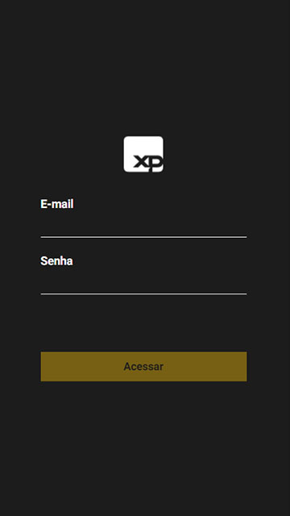
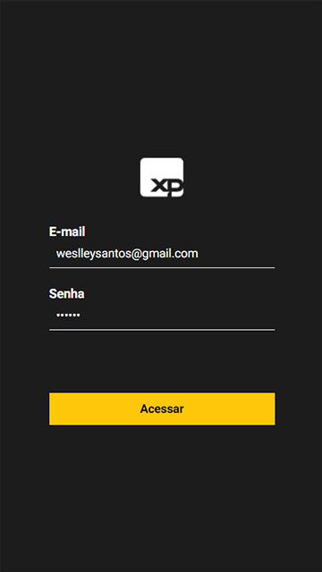
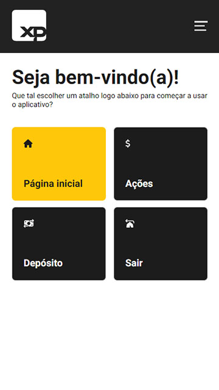
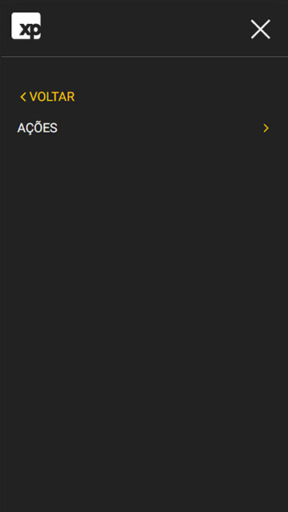
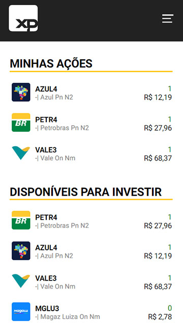
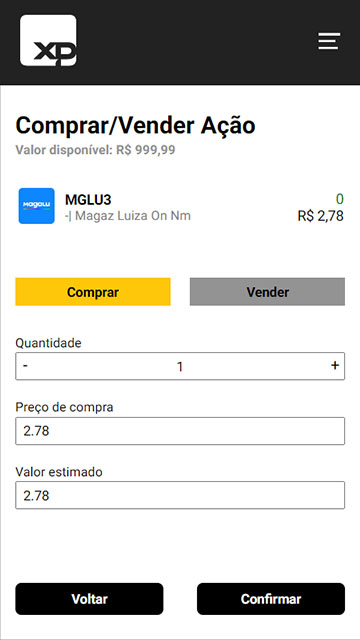
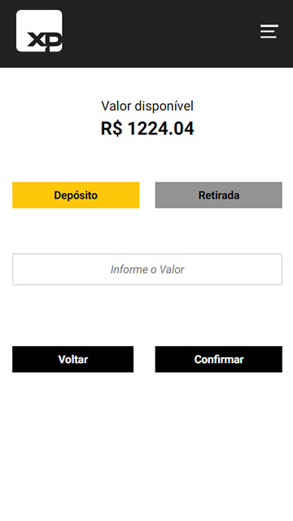
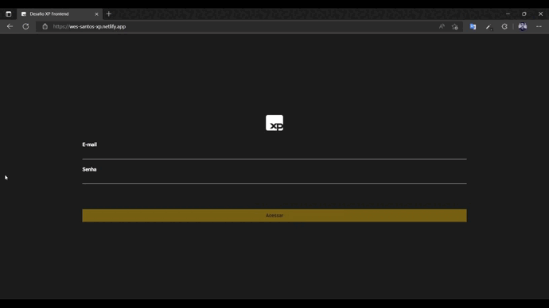

<h1>Desafio de Mobile/Front-end XP Inc.</h1>

Este projeto foi feito com o conceito de Mobile First e simula um aplicativo de investimento em ações com algumas funcionalidades de uma conta digital

Para desenvolvê-lo, me inspirei no design do aplicativo da XP Investimentos, desde a escolha de cores e o uso de elementos próprios da empresa até a própria logo da empresa.

Dessa forma, o aplicativo tem as seguintes páginas: login, ações disponíveis, compra e venda de ações, página de conta com opção de depósito ou retirada de dinheiro e uma página inicial simples.

As ações que são exibidas na tabela vêm de uma <a href="https://github.com/wes-santos/desafio-xp-backend" target="_blank">API super simples</a> que criei apenas para ter uma base de dados para a aplicação. Em geral, ela foi criada com Sequelize seguindo a arquitetura MSC e seu deploy foi realizado no <a href="https://desafio-xp-backend.herokuapp.com/" target="_blank">Heroku</a> para possibilitar a integração com o Front. O banco de dados está armazenado no Supabase, uma vez que utilizei o Sequelize com dialeto Postgres.

<h2>Tabela de conteúdos</h2>
<ul>
  <li><a href="#1">Como a aplicação funciona?</a></li>
    <ul>
      <li><a href="#1-1">Tela de login</a></li>
      <li><a href="#1-2">Página inicial</a></li>
      <li><a href="#1-3">Página de ações</a></li>
      <li><a href="#1-4">Página de negociação</a></li>
      <li><a href="#1-5">Página de depósito e retirada</a></li>
    </ul>
  <li><a href="#2">Tecnologias usadas</a></li>
    <ul>
      <li><a href="#2-1">React</a></li>
      <li><a href="#2-2">React Router</a></li>
      <li><a href="#2-3">React Testing Library</a></li>
      <li><a href="#2-4">Redux</a></li>
      <li><a href="#2-5">Styled Components</a></li>
      <li><a href="#2-6">Axios</a></li>
      <li><a href="#2-7">ESLint</a></li>
      <li><a href="#2-8">JavaScript ES6</a></li>
    </ul>
  <li><a href="#3">Como executar o projeto</a></li>
    <ul>
      <li><a href="#3-1">Execução de testes</a></li>
    </ul>
  <li><a href="#4">Próximos passos pensados para a continuidade do desenvolvimento</a></li>
  <li><a href="#5">Referências</a></li>
</ul>

<h2><a name="1">Como a aplicação funciona?</a></h2>

O aplicativo esta dividido em diferentes telas, sendo que cada uma delas tem uma funcionalidade específica na aplicação.

<h3><a name="1-1">Tela de login</a></h3>

Visualizar imagem

  <table>
    <tr>
      <td>
      </td>
      <td>
      </td>
    </tr>
    <tr>
      <td>
        
      </td>
      <td>
        
      </td>
    </tr>
  </table>

Ao acessar a aplicação, a pessoa usuária se depara com uma tela de login contendo um campo para digitação do e-mail e um outro para a senha.

Inicialmente, o botão de acesso está desabilitado e não pode ser clicado até que os campos de e-mail e senha sejam preenchidos de forma válida. Desse modo, o e-mail precisa ter um formato válido, como email@email.com, e a senha precisa ter ao menos seis caracteres.

Após preencher os dados corretamente, o botão de acesso é habilitado e ao clicar nele a pessoa usuária é direcionada para a página inicial do aplicativo.

<h3><a name="1-2">Página inicial</a></h3>

  
Visualizar imagem

  

Nesta página, há uma mensagem inicial de boas vindas e um pequeno trecho de texto sugerindo a escolha de um dos atalhos logo abaixo dele para começar a utilizar a aplicação.

Basicamente, esses atalhos podem levar a pessoa usuária rapidamente para a página de ações ou de depósito. Além disso, há uma opção para ela sair da aplicação rapidamente, caso ela deseje, sendo redirecionada para a tela de login novamente.

No canto superior direito da aplicação, há um ícone no qual a pessoa usuária pode clicar para que um menu lateral seja aberto. Neste menu, há opções para que ela possa ir para qualquer uma das páginas da aplicação de forma fácil e rápida.

  
Visualizar imagens

  <table>
    <tr><td /><td /></tr>
    <tr>
      <td></td>
      <td></td>
    </tr>
  </table>

<h3><a name="1-3">Página de ações</a></h3>

  
Visualizar imagem

  

        

Nesta página, é possível visualizar tanto as ações disponíveis para investimento no aplicativo quanto as ações que já foram compradas pela pessoa usuária.

De início, independentemente do e-mail ou senha que utilizar para entrar, a pessoa usuária começa com uma unidade de três ações diferentes: Azul, Petrobras e Vale.

Basicamente, cada ativo tem as seguintes características: código, preço, quantidade, imagem e subtítulo. O código é um identificador único da ação, como 'PETR4' para Petrobras.

O subtítulo é uma descrição maior do ativo, como 'Petrobras Pn N2' para a ação de código 'PETR4'. Nessa lógica, ele indica que 'PETR4' é uma ação preferencial (Pn) da Petrobras e quem tem um nível N2, que é como se fosse um "selo" atribuído as empresas pela Bovespa para indicar a adoção de boas práticas.

A quantidade de ações que a pessoa usuária tem de um ativo específico naquele momento é exibida logo acima do preço em um número de cor verde.

Dessa maneira, sempre que comprar ou vender uma ação, este número será alterado para a quantidade de ações que tiver. A imagem é simplesmente uma representação visual da empresa em questão.

<h3><a name="1-4">Página de negociação</a></h3>

  
Visualizar imagem

  <table>
    <tr><td /><td /></tr>
    <tr>
      <td></td>
      <td></td>
    </tr>
  </table>

Ao clicar em uma das ações disponíveis na página anterior, a pessoa usuária é direcionada para a página de negociação.

Nesta página, é possível visualizar o valor disponível em conta para investir, o preço da ação que clicou, a quantidade já comprada e algumas coisas a mais.

De início,  o botão de compra vem selecionado por padrão, mas a pessoa usuária pode clicar no botão de vender caso ela deseje realizar a ação contrária.

Logo abaixo, há um campo que pode ser alterado para que a pessoa usuária indique quantas ações do ativo que ela escolheu ela deseja comprar ou vender (de acordo com o botão de escolha).

Nesse ponto, a alteração pode ser feita tanto por meio de digitação quanto pelo clique ou toque em um dos botões laterais de adição ou subtração. Aqui, não é possível selecionar um valor menor do que 1.

Em seguida, há um campo para exibição do preço de compra da ação e do preço total de acordo com a quantidade de ações que deseja comprar ou vender. Um ponto importante é que esses dois campos não podem ser alterados, estão ali apenas para visualização da pessoa usuária.

Logo após, há um botão para confirmar a compra ou venda e um outro para voltar a página de ações.

Caso escolha uma quantidade de ações cujo preço total ultrapasse o valor disponível em conta, a transação não será realizada e uma mensagem aparecerá na tela para alertar do ocorrido e dar como opção para a pessoa usuária depositar mais dinheiro ou voltar para a página de negociação.

O mesmo ocorre caso tente vender um ativo que ainda não comprou, apenas com uma mensagem um pouco diferente.

Quando o preço é compatível com o valor em conta, a transação é realizada, sua quantidade é alterada e o saldo da conta é subtraído do valor do investimento.

<h3><a name="1-5">Página de depósito e retirada</a></h3>

  
Visualizar imagem

  

A página de depósito e retirada pode ser acessada na aplicação por meio da página inicial, do menu lateral ou do aviso recebido ao tentar realizar uma transação inválida na página de negociação.

Nela, é possível visualizar o saldo disponível em conta e adicionar mais dinheiro ou remover dinheiro da conta. De início, o botão de depósito vem selecionado e ele indica que a pessoa usuária deseja acrescentar dinheiro ao saldo.

Para isso, basta inserir o valor desejado no campo indicado e depois clicar no botão de confirmar. Caso tente retirar mais dinheiro do que tem disponível em conta, um alerta é exibido na tela dizendo que não tem dinheiro suficiente para realizar a transação.

Ao clicar no botão de voltar, a pessoa usuária é redirecionada para a página inicial do aplicativo.

<h2><a name="2">Tecnologias usadas</a></h2>
<h3><a name="2-1">React</a></h3>

A escolha do React foi feita pensando principalmente em escalabilidade, agilidade e recursos disponíveis. Basicamente, a componentização me permitiu uma boa organização do código, o que o tornou mais limpo.

Somado a isso, o fato de ter a aplicação dividida em componentes e páginas permite que eu crie novas funcionalidades de maneira muito mais rápida, uma vez que eles podem ser reaproveitados devido à sua lógica de implementação.

Para inserir um novo tipo de ativo à ferramenta, por exemplo, bastaria criar uma nova rota, uma nova entrada no menu lateral que está componentizado e reutilizar os componentes criados para deixar essa página semelhante a de ações.

Ademais, o React permitiu a utilização de ferramentas que facilitaram, agilizaram e melhoraram muito o desenvolvimento, como o React Router e o React Testing Library. Outros pontos que não podem ser deixados de lado para a escolha do React é a utilização de JSX, hooks e estado.

Um último ponto pensado para a escolha de React foi a existência do React Native. Embora não tenha utilizado React Native e ainda não tenha muito conhecimento sobre ele, sei que é uma linguagem de sintaxe similar ao React que permite a criação de aplicações nativas para dispositivos Android e iOS.

Logo, com base nesta aplicação, seria mais ágil criá-la para um dispositivo móvel sem perder muito em performance, tendo em vista, ainda, que ela foi desenvolvida com o conceito Mobile First.

<h3><a name="2-2">React Router</a></h3>

Desde que conheci o React Router me apaixonei por essa ferramenta. Decidi utilizá-lo na aplicação para que ela tivesse uma navegação mais rápida e fluída.

Em outras palavras, optei pelo React Router para que eu pudesse criar uma Single Page Application com o uso de um pacote que conheço, tem boas funcionalidades e gosto de utilizar.

<h3><a name="2-3">React Testing Library</a></h3>

Optei por utilizar o React Test Library para criação dos testes unitários automatizados da aplicação. Basicamente, criar a aplicação sem testá-la nunca foi uma hipótese no planejamento do projeto e utilizar o RTL para isso me soou como a melhor escolha principalmente pelo foco no usuário.

Por meio do RTL, consegui testar meu código com uma visão de usuário, optando sempre que possível por queries focadas em acessibilidade para seleção de elementos. Cobri grande parte do código com esses testes.

De início, tinha o desejo de realizar testes automatizados E2E com o Cypress para a aplicação também, mas como seria a primeira vez utilizando a ferramenta e o prazo era relativamente curto, decidi focar em fazer bons testes unitários e desenvolver uma aplicação front-end completa.

<h3><a name="2-4">Redux</a></h3>

No começo era tentador a escolha do ContextAPI para o gerenciamento do estado por vê-lo como uma ferramenta mais fácil de ser utilizada, principalmente em aplicações pequenas. Dado o tamanho do aplicativo que iria criar, penso ainda que poderia ter sido uma boa escolha.

Contudo, optei por Redux pensando em organização de código e escalabilidade. Nesse sentido, vejo o Redux como uma ferramenta mais completa para a gestão de estado da aplicação e acredito que em uma aplicação grande ele tenha uma adaptação melhor do que o Context.

Embora a aplicação que eu tinha para desenvolver fosse relativamente pequena, a fiz pensando em escalabilidade e não faria sentido deixar o Redux de lado tendo esse ponto.

Nunca havia utilizado o Redux com Hooks e foi um desafio inicial aprender a configurá-lo para isso. Ainda que eu tenha descoberto no caminho que existe uma outra maneira de configurar o Redux por meio do Toolkit, optei por uma forma mais próxima da que eu estava familiarizado para evitar problemas durante o desenvolvimento e adqurir agilidade na produção.

<h3><a name="2-5">Styled Components</a></h3>

Como minha ideia inicial era ter um visual próximo ao do aplicativo da XP Investimentos, era claro para mim que eu teria que criar o CSS da aplicação e não utilizar alguma biblioteca ou framework como Bootstrap.

Tendo isso em mente, pensei em utilizar o Styled Components ou o Tailwind CSS, uma vez que eles agilizariam o trabalho. Afinal, embora goste muito do princípio KISS, o tempo não estava completamente ao meu favor.

Como não tenho experiência com Tailwind CSS, optei pelo Styled Components para criar toda a estilização da aplicação. Por meio dele, tenho maior facilidade em manter o escopo das estilizações bem como padronizá-las, além de já ter o Sass integrado, algo que facilita muito.

<h3><a name="2-6">Axios</a></h3>

Consumir dados de uma API é algo extremamente comum em uma aplicação front-end e estava em meus planos criar uma API simples para utilizar neste projeto.

Embora nunca tivesse utilizado o Axios antes, o conhecia e sabia que era uma ferramenta que facilitava e agilizava esse processo. Com isso em mente, optei por utilizá-lo para realizar as requisições necessárias.

<h3><a name="2-7">ESLint</a></h3>

Pensando em manter uma boa qualidade de código, optei por instalar o <a href="https://github.com/airbnb/javascript" target="_blank">ESLint do Airbnb</a> no projeto desde o início.

Ainda que a maior parte das práticas estabelecidas pela ferramenta tenham fixado em minha cabeça de tanto segui-las, gosto de utilizar o ESLint em projetos para garantir que estou seguindo bons padrões.

Em soma, eu utilizo o ESLint como formator padrão e, por isso, ele agiliza bastante o meu processo de produção, algo que também influencia o fato de eu sempre instalá-lo.

<h3><a name="2-8">JavaScript ES6</a></h3>

Optei por desenvolver a aplicação em JavaScript ES6 por agilidade. Dada a minha formação, tenho maior familiaridade e fluência com essa linguagem e com o prazo que eu tinha para desenvolver o aplicativo me pareceu a escolha mais correta a se fazer.

Pensei em desenvolver a aplicação em TypeScript, por ver diversas vantagens nesta linguagem. Contudo, nunca utilizei TypeScript com React e sabia que não teria muito tempo para investir buscando sobre como tipar determinados elementos e resolver possíveis problemas que surgissem pela inexperiência.

<h2><a name="3">Como executar o projeto?</a></h2>

Para executar este projeto localmente você precisará ter o Node Package Manager (NPM) na versão 16 e o Git. Caso prefira, você pode utilizar a ferramenta normalmente por meio do <a href="https://wes-santos-xp.netlify.app" target="_blank">site em que foi realizado o seu deploy</a> sem que precise instalar nada.

Como se trata de uma aplicação desenvolvida em Mobile First, é recomendado que você a acesse por meio de um celular ou que utilize o recurso de responsividade do navegador. Para isso, clique com o botão direito do mouse na tela e depois em inspecionar.

Na ferramenta que abrir, clique no ícone com dois celulares logo ao lado de "Elementos". Caso esteja no Firefox, esse ícone se encontra próximo ao botão de fechar o inspetor em sua parte superior direita.

Após isso, altere a resolução selecionando um dispositivo mobile de sua preferências no menu disponível ou digitando um valor como "360 x 640".

Caso prefira executar a aplicação localmente, siga os seguintes comandos após ter sanado as dependências necessárias (NPM e Git):

<pre>
git clone git@github.com:wes-santos/desafio-xp-frontend.git
</pre>
<pre>
cd desafio-xp-frontend
</pre>
<pre>
npm install
</pre>
<pre>
npm start
</pre>

Após a execução dos comandos citados acima, a aplicação React deve rodar nativamente na porta 3000 da sua máquina, caso ela não esteja sendo utilizada por algum outro serviço. Então, basta acessá-la por meio de seu navegador, caso ele não seja aberto automaticamente.

Para isso, digitar 'localhost:3000' na barra de endereços do navegador e apertar enter. Se tudo correu como o esperado, você verá a aplicação em execução e ela está pronta para ser utilizada.

Independentemente de ter executado a aplicação localmente ou não, a recomendação de utilizar o modo responsivo do navegador para ter uma melhor experiência continua sendo válida.

<h3><a name="3-1">Execução de testes</a></h3>

Uma vez que já tenha instalado as dependências do projeto, para rodar todos os testes basta executar o seguinte comando:

<pre>
npm test
</pre>

Caso queira checar a cobertura de testes:

<pre>
npm run test:coverage
</pre>

<h2><a name="4">Próximos passos pensados para a continuidade do desenvolvimento</a></h2>

Pensando em uma possível evolução deste projeto, o menu foi feito com uma seção para investimentos que tem dentro ações.

Nessa lógica, essa escolha foi feita para que novos ativos possam ser inseridos facilmente no futuro, como títulos de renda fixa ou outros itens de renda variável.

Além disso, novas funcionalidades podem ser implementadas, como um campo para busca de ativos e a definição de filtros.

Pensei também na adição de um elemento que levasse a pessoa usuária para uma página de FAQ com instruções sobre as funcionalidades do aplicativo. Seria como um ícone flutuante de ajuda que estaria disponível em todas as telas e poderia ser fechado em um clique ou toque.

Gostaria de ter feito testes automatizados E2E com o Cypress também, uma vez que apenas testes unitários foram feitos.

Outro recurso pensado durante o desenvolvimento seria a limitação de ativos exibidos para a pessoa usuária na página de ações com a criação de um botão "ver mais" para dar a ela o controle da quantidade exibida.

Por fim, os últimos pontos pensados para evolução no momento seria o uso de TypeScript em toda a aplicação e um back-end com mais funcionalidades para criação de uma melhor integração no front-end, bem como adição de recursos, como o cadastro de novas pessoas usuárias.

<h2><a name="5">Referências</a></h2>

Durante o desenvolvimento do projeto, naturalmente algumas dificuldades foram surgindo, principalmente para execução de ações que ainda não sabia claramente como fazer.

Por isso, para algumas features, foram consumidos os seguintes conteúdos:
<ul>
<li><a href="https://medium.com/@Tunmise/set-up-eslint-with-airbnb-style-guide-in-5-minutes-d7b4cc5707f8" target="_blank">Consulta para instalação do ESLint Airbnb</a>;</li>
<li><a href="https://www.youtube.com/watch?v=Sl_tsr2gEhE" target="_blank">Criação de uma sidebar</a>;</li>
<li><a href="https://www.youtube.com/watch?v=7L7MhxjI4PE" target="_blank">Utilização do redux com hooks</a>;</li>
<li><a href="https://www.youtube.com/watch?v=GpAAQnrxiGQ" target="_blank">Configuração do configureStore</a>;</li>
<li><a href="https://stackoverflow.com/questions/69502147/changing-from-redux-to-redux-toolkit" target="_blank">Utilização do Thunk com o configureStore</a>;</li>
<li><a href="https://www.w3resource.com/javascript/form/email-validation.php" target="_blank">Regex para validação do e-mail</a>;</li>
<li><a href="https://www.youtube.com/watch?v=lA8o3kUl1TA" target="_blank">Hook useRef em inputs</a>;</li>
<li><a href="https://stackoverflow.com/questions/36051883/how-to-select-all-text-in-input-with-reactjs-when-it-focused" target="_blank">Uso do handleFocus para selecionar o conteúdo de um input</a>;</li>
<li><a href="https://stackoverflow.com/questions/62258250/why-clear-method-not-exist-on-testing-library-user-event" target="_blank">Método clear para o userEvent</a>;</li>
<li><a href="https://stackoverflow.com/questions/67017951/how-to-render-with-router-as-well-as-with-redux-for-react-testing-library" target="_blank">Criação de uma função para renderização de um componente com Router e Redux para testes em RTL</a>;</li>
<li><a href="https://v5.reactrouter.com/web/guides/testing" target="_blank">Começar a partir de uma rota específica no RTL</a>;</li>
<li><a href="https://stackoverflow.com/questions/57886008/how-to-get-code-coverage-in-react-with-react-testing-library" target="_blank">Criação de script para obter a cobertura de testes</a>;</li>
<li><a href="https://cursos.alura.com.br/forum/topico-erro-cors-policy-98330" target="_blank">Resolução de problema que tive com Cors no momento de criação da minha API</a>;</li>
<li><a href="https://blog.rocketseat.com.br/axios-um-cliente-http-full-stack/" target="_blank">Conhecimento inicial do Axios</a>;</li>
<li><a href="https://github.com/axios/axios#features" target="_blank">Buscas específicas sobre o Axios, como uso do async await</a>.</li>
</ul>
